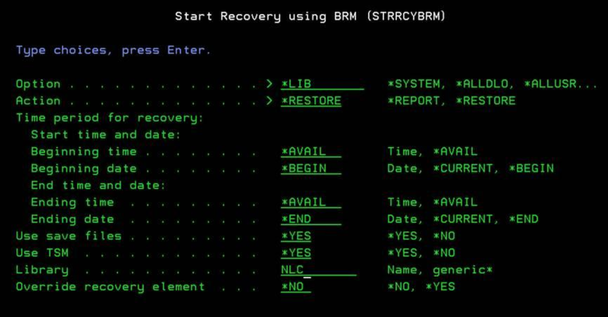
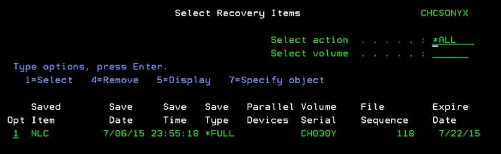
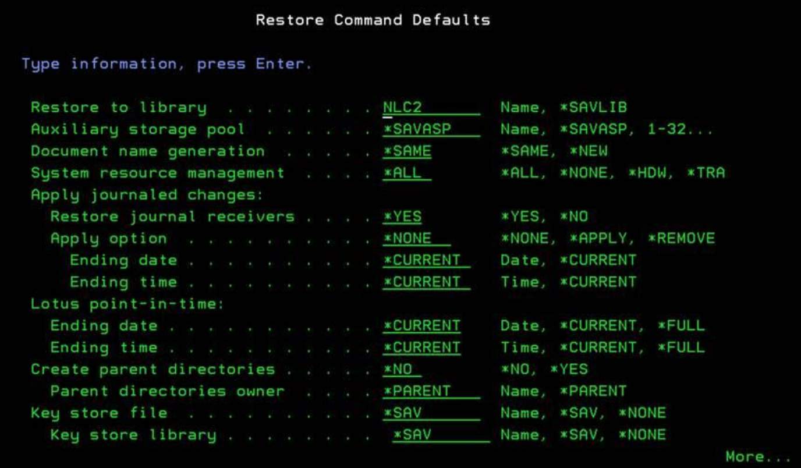
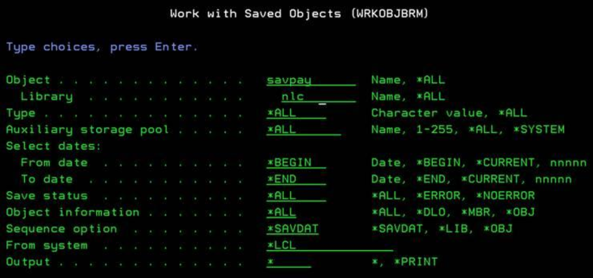

# Backups

## Backups

This section is meant to provide information if you've purchased VTL \(Virtual Tape Library\) with your Litmis Spaces IBM i partition.

### BRMS Restore

The process is the same as if you were using the RSTLIB command. There is a parameter in the restore command to restore to a different library.

#### To Recover a Library to a Different Library

**Steps:** `GO BRMS`

* Select option `4. Recovery`
* Select option `2. Perform recovery`
* Select option `4. Recover library`

On the Start Recovery using BRM enter the Library \(Ex. `NLC`\) and hit the Enter key, as shown below.

The select Recovery Items screen shows all the backup versions. Enter option 1 next to the date you want to restore from and Press F9 Recovery Defaults \(This is where we can change the restore parameters like the Restore To Library\)

Page Down and enter the Restore to Library \(Ex. `NLC2`\)

Enter any other parameters you may want to change then Hit Enter to change the Restore Defaults.

Then Hit Enter again to start the Restore.

#### To Recover an Object to a Different Library

You will have to create the target library first and then follow these steps:

`GO BRMS`

* Select option `4. Recovery`
* Selection option `2. Perform recovery`
* Select option `6. Work with saved objects`

Specify the object and library \(Ex. `savpay` `nlc`\) and hit Enter, as shown below.

Then select option `7 Restore Object` next to the backup version date you want to restore and hit enter.

On the `Select Recovery Items` screen hit `F9 Recovery Defaults` \(page down to specify the `Restore To Library`\) then hit Enter. Then hit Enter again to start the restore.

### System Recovery

This requires a notification to Litmis Support \(team@litmis.com\). Also, periodic full system backups must have been performed prior to any system recovery requests. Detailed BRMS recovery reports should be kept and provided to identify virtual tape volume to be used for such recovery purposes.

## Purchase Backups

If don't have backups and you'd like to purchase them, please contact team@litmis.com

