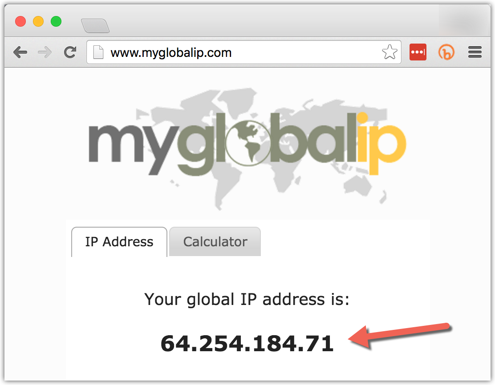
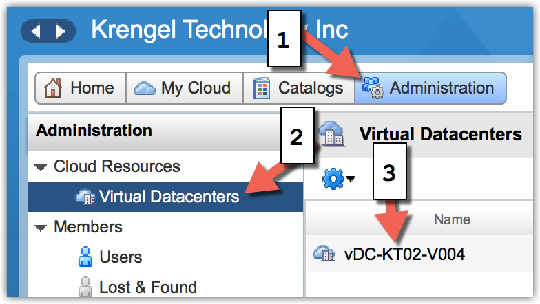
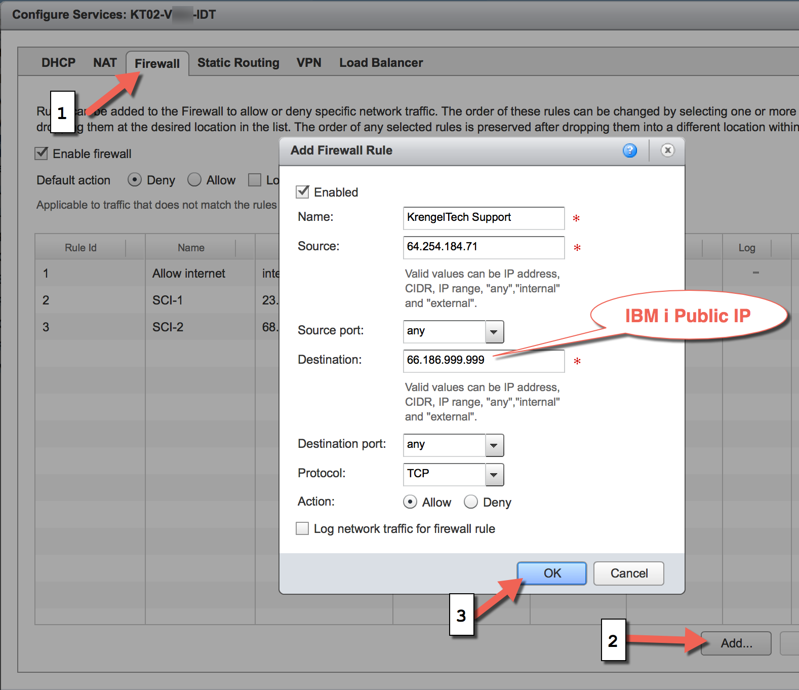

# Connect To IBM i

When you sign up for a Litmis Spaces _single tenant_ server you will have one of two firewall configurations; either vShield Edge \(free\) or SOPHOS \(additional charge\).  

By default the firewall is fairly locked down and you must log into it and configure your IP address to be allowed access to your IBM i. This documentation will walk you through that process for both of the firewalls. 

## vShield Edge  {#vcloud-vshield-edge-gateway-firewall}

This section will describe how to setup the vShield Edge firewall.  You should have received an email with the following information.

**Firewall URL:**[https://cloud.domain.com/cloud/org/KT02-V999/](https://cloud.domain.com/cloud/org/KT02-V999/)  
**Username:**admin  
**Password:**xxxxxxxx

**IBM i Internet IP:**66.186.999.999  
**IBM i Intranet IP:**192.168.0.2  
**Username:**QSECOFR  
**Password:**xxxxxxx

**Step 1:**Go to myglobalip.com and obtain your public IP so it can be put into the firewall.  

**Step 2:**Open the Firewall URL from your email and click on the below buttons and links.

**Step 3:**Select Edge Gateway tab, right click on the entry in the list and select Edge Gateway Services.  

**Step 4:**Add a Firewall entry for your public IP so you can connect to the IBM i public IP.  

After hitting OK above the firewall needs about 10 seconds to apply the new configuration and you are now ready to connect a 5250 telnet session using the _IBM i Public IP_ mentioned above \(the one from your email\).

## SOPHOS

**Step 1:**Go to myglobalip.com and obtain your public IP so it can be put into the firewall.  

Log into the SOPHOS interface and navigate to the **NAT** tab and create a **New NAT Rule**, as shown below.

You should be presented with the following **Add NAT Rule** window.  You'll need to modify the **For traffic from**, **Going to**, and **Automatic firewall rule** attributes.  The second window shown, **Add Network Definition**, appears when you click the green plus sign.  Paste the IP address from Step 1 into the  **IPv4 address** field and select the **OK** button.  **A red error message will display.** This is expected. Click **OK** again.

Below is a screenshot of adding the **Going to** mapping.  First you'll need to click the folder icon to the right of the **Going to** field to bring up the **Networks** listing that is shown in the far left.  Drag the entry named "External \(WAN\) \(Address\)" from the listing to the **Going to** field.

Alter the **Change the destination to** field to be that of the IBM i IP address, as shown below.

Select the **Automatic firewall rule** checkbox and **Save**, as shown below.

The last step is to toggle the firewall rule to be turned on \(green\), as shown below.

