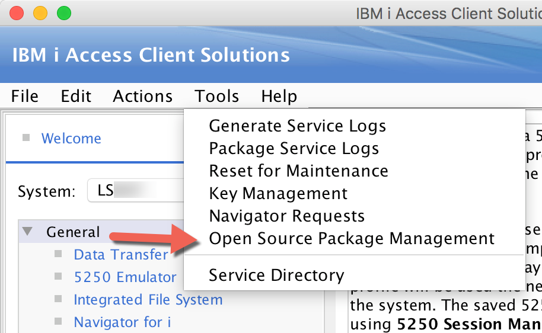
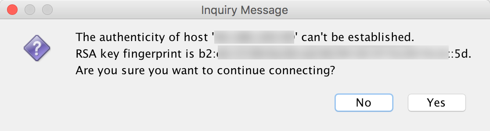
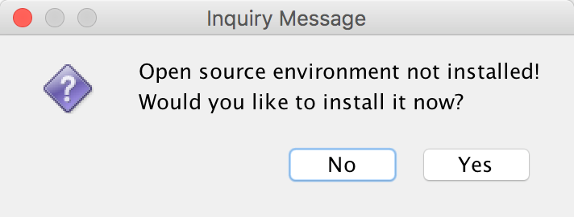
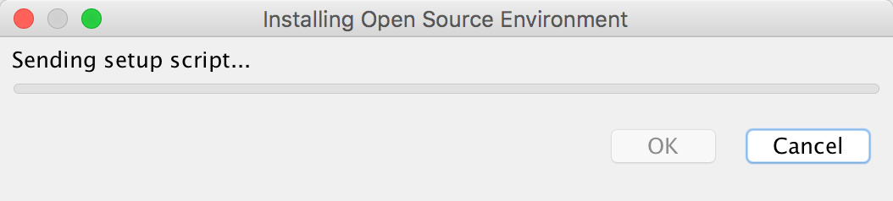
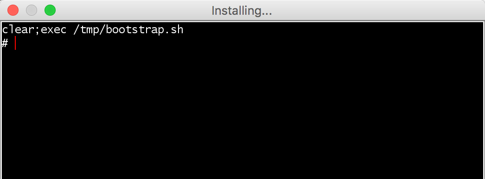
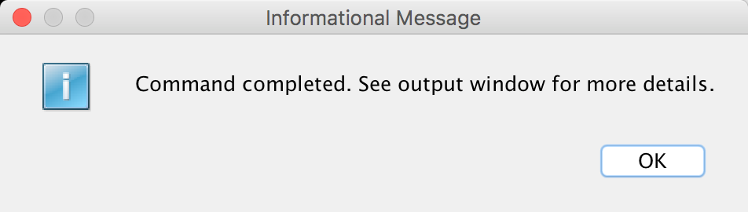
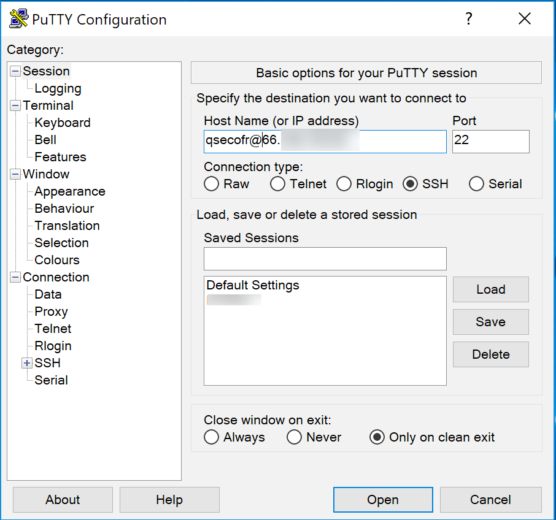
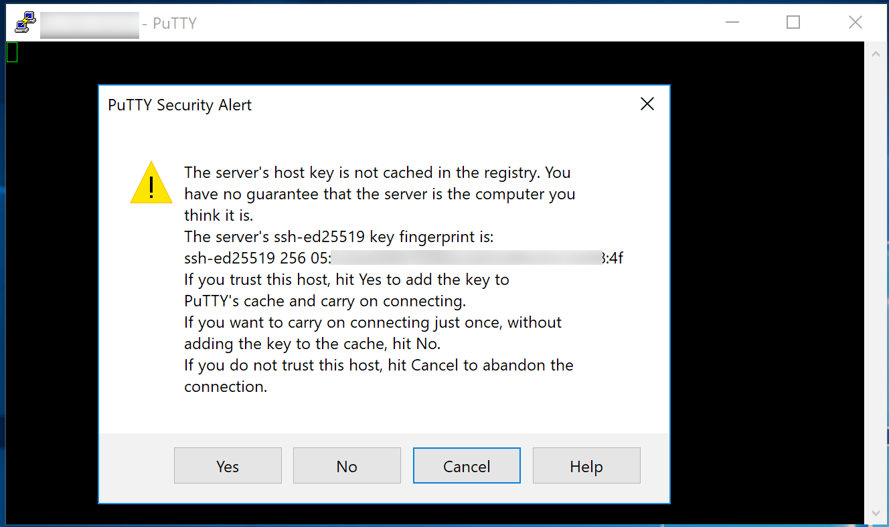
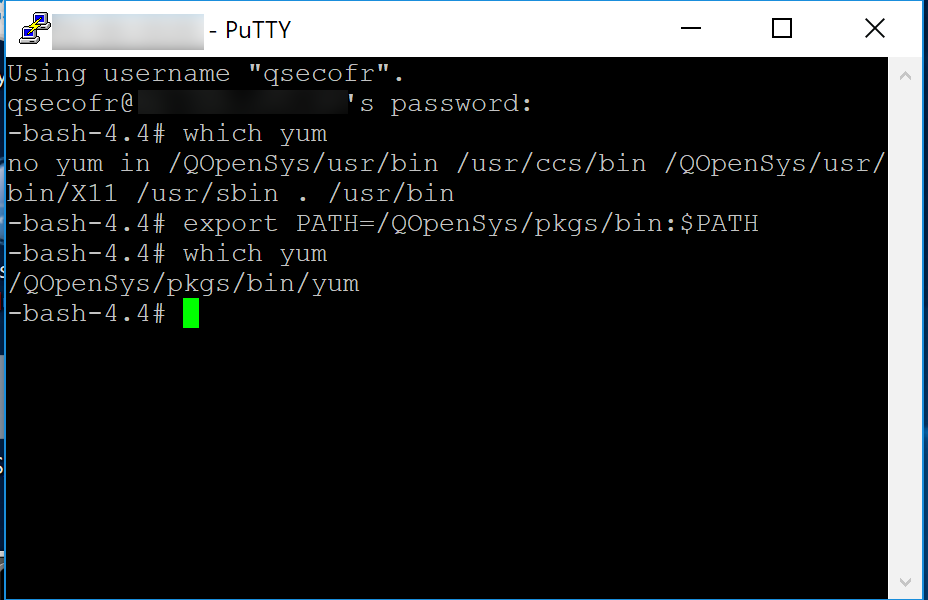

# Open Source Installation

First, [download ACS \(Access Client Solutions\)](http://www-01.ibm.com/support/docview.wss?uid=isg3T1026805) and install it on your laptop.  `Select Tools->Open Source Package Management`, as shown below.



Select your system from the drop-down \(you'll need to configure it first if you haven't already done so\).  Best to use a QSECOFR profile.  


Accept the RSA key.



Select `Yes`



Wait while it installs.



Wait some more.  You should see a window similar to the below.



Installation is complete!




You can kick the tires by first starting the SSH server on IBM i using the following command from a 5250 telnet session.

`STRTCPSVR *SSHD`

Run the following to set the default shell to Bash.  Use STRSQL or the Run SQL Scripts feature in ACS.

```text
CALL QSYS2.SET_PASE_SHELL_INFO('*DEFAULT', '/QOpenSys/pkgs/bin/bash')
```

Next, download a shell client, like [putty](https://www.chiark.greenend.org.uk/~sgtatham/putty/latest.html).

Enter your profile \(doesn't need to be QSECOFR\) an @ sign, and the IP of your machine and select **Open**, as shown below.



Accept the server by selecting **Yes**, as shown below.



You will be prompted for your password.  The open source software isn't in your `PATH` environment variable by default so you'll need to add it, as shown below.



At this point the base Yum package manager and supporting software \(i.e. bash, python\) is installed.  You can now run `yum` commands to install additional software.  Some examples are below.

```text
yum install nodejs8

yum install '*gcc*'
```

