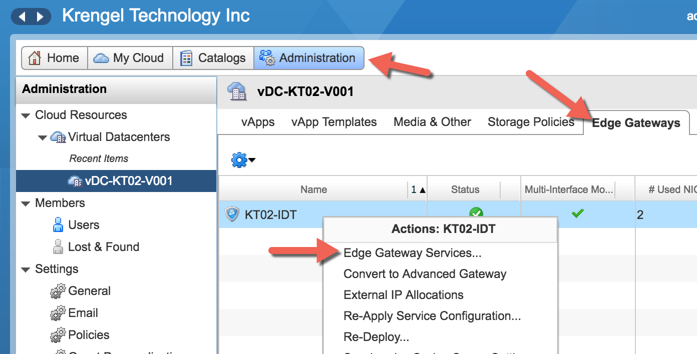
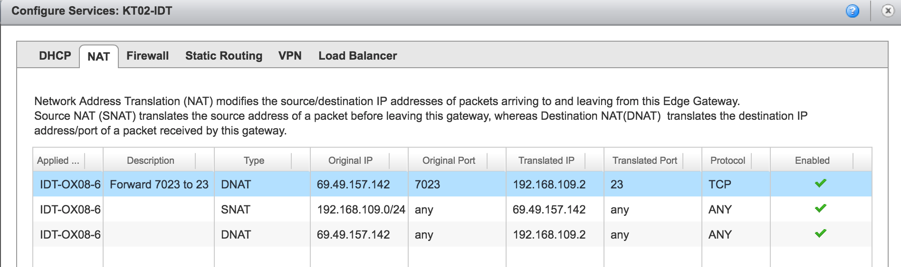
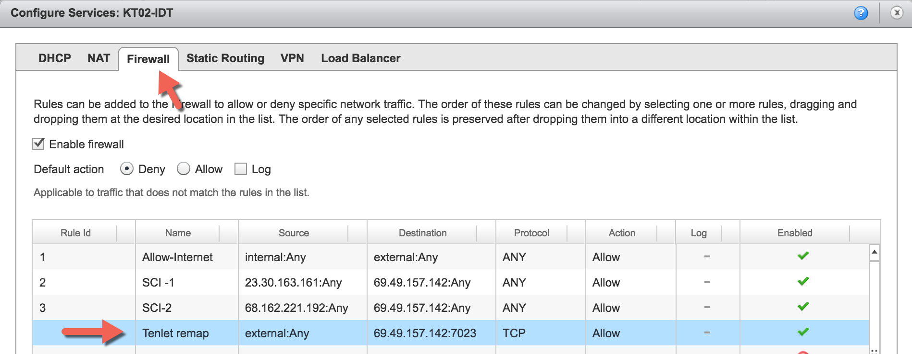

# Port Forwarding

These instructions detail how to setup port forwarding. The scenario is the desire to have telnet's port of 23 be exposed as port 7023 to the outside world.

**NOTE:** ACS \(Access Client Solutions\) has many ports that would need to be remapped.

First navigate to `Configure Services` pop-up window, as shown below. 

Select the `NAT` tab. Add a new `DNAT` entry **at the top** \(needs to be at the top\). The `Original IP` should be your IBM i public IP and the `Translated IP` should be your internal IBM i IP.

Next, select the `Firewall` tab and create an entry as shown below. Note the `Source` should be `external:Any` and the `Destination` should be your IBM i public IP with a port of 7023.

Save the entry and wait for the settings to be applied \(usually less than 10 seconds\).

Now you should be able to telnet to port 7023 instead of 23.

