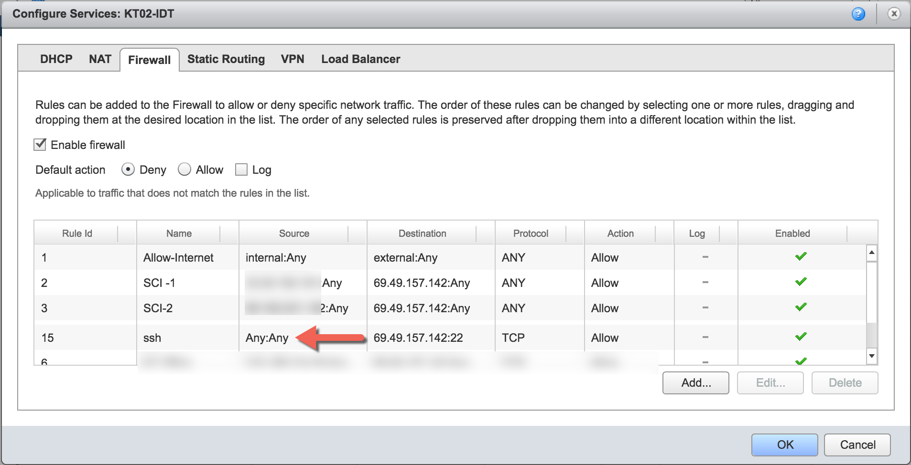
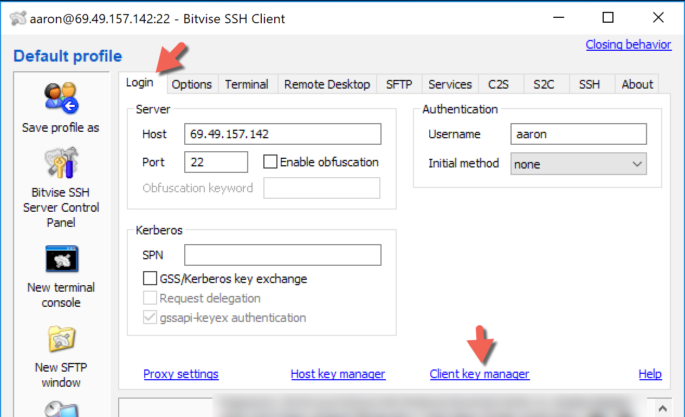
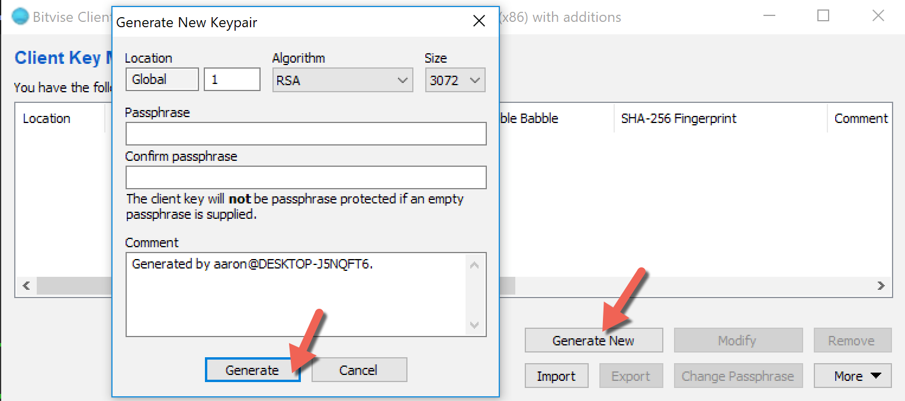
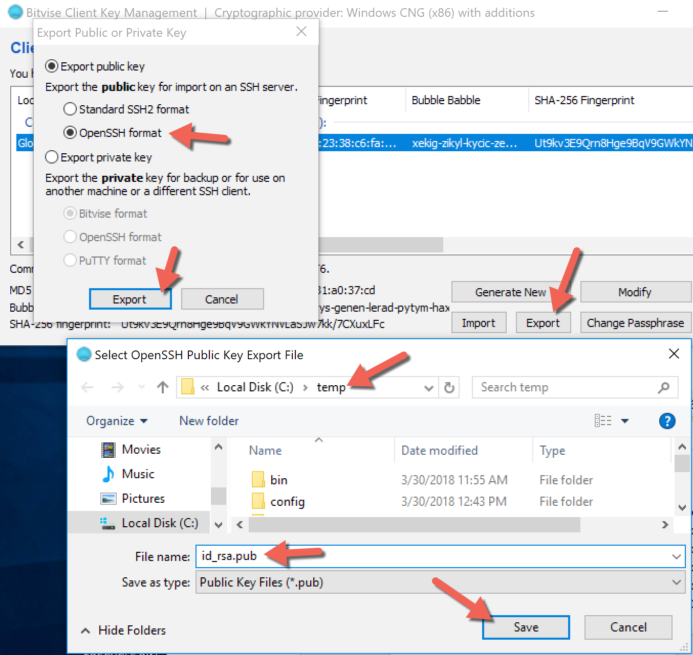

# SSH Tunnels

SSH tunnels allow you to route various kinds of traffic \(i.e. telnet, JDBC\) through an encrypted connection to your remote IBM i.  It is similar in purpose to a VPN connection yet fairly different in implementation.  SSH tunnels do not require any additional software on the IBM i side.

This tutorial will guide you through creating an SSH tunnel for ACS \(Access Client Solutions\).

First, configure your firewall to allow traffic from any IP on port 22 \(the SSH port\), as shown below.



Make sure the `*SSHD` server from a 5250 command line using the following command.

`STRTCPSVR *SSHD`

Next, [download the Bitvise client](https://www.bitvise.com/ssh-client-download) \(free\) and install it on your Windows desktop.  Bitvise will be used to configure and route ACS traffic.  

The below video shows how to configure Bitvise to route all traffic for 127.0.0.1 to the public IP address of your IBM i.  Once Bitvise is configured then you will setup a new connection in ACS.  Notice how the IP address used in ACS is 127.0.0.1.  This is telling ACS to route the telnet \(and other traffic like Run SQL Scripts\) to the local laptop where Bitvise is waiting to receive the traffic and forward it to the public IBM i IP address.  When the SSH server on IBM i receives the traffic it will route it to the correct port \(i.e. port 23 for telnet\).

{% embed data="{\"url\":\"https://www.screencast.com/t/Vx9F2FXW8a\",\"type\":\"video\",\"title\":\"2018-05-30\_13-53-00.mp4\",\"description\":\"Shared from Screencast.com\",\"icon\":{\"type\":\"icon\",\"url\":\"https://www.screencast.com/favicon.ico\",\"aspectRatio\":0},\"thumbnail\":{\"type\":\"thumbnail\",\"url\":\"https://content.screencast.com/users/AaronBartell/folders/Snagit/media/7a00ca2f-13a2-46b9-9312-7a74113c324a/FirstFrame.jpg\",\"width\":960,\"height\":738,\"aspectRatio\":0.76875},\"embed\":{\"type\":\"player\",\"url\":\"https://content.screencast.com/users/AaronBartell/folders/Snagit/media/7a00ca2f-13a2-46b9-9312-7a74113c324a/2018-05-30\_13-53-00.mp4\",\"html\":\"<div style=\\\"left: 0; width: 100%; height: 0; position: relative; padding-bottom: 76.8758%;\\\"><video controls poster=\\\"https://content.screencast.com/users/AaronBartell/folders/Snagit/media/7a00ca2f-13a2-46b9-9312-7a74113c324a/FirstFrame.jpg\\\" style=\\\"top: 0; left: 0; width: 100%; height: 100%; position: absolute;\\\">Your browser does not support HTML5 video.<source src=\\\"https://content.screencast.com/users/AaronBartell/folders/Snagit/media/7a00ca2f-13a2-46b9-9312-7a74113c324a/2018-05-30\_13-53-00.mp4\\\" type=\\\"video/mp4\\\"></video></div>\",\"aspectRatio\":1.3008}}" %}

If you have any questions feel free to email [team@litmis.com](mailto:).

## Password-less Authentication

To add an extra layer of security you can turn off password authentication and instead rely entirely on SSH keys.  This means only those that have copied their public SSH key to the IBM i can log in.  By doing this you eliminate the ability for a hacker to do a brute force attack by learn the password by repeated login attempts.

Edit file `/QOpenSys/QIBM/ProdData/SC1/OpenSSH/etc/sshd_config` to have the following configurations set.

```text
PermitRootLogin no
PasswordAuthentication no
PermitEmptyPasswords no
```

You'll need to restart SSH for the changes to take effect.

```text
ENDTCPSVR *SSHD
STRTCPSVR *SSHD
```

Next you need to create an SSH key on you laptop that can be copied to your `~/.ssh/authorized_keys` file on the IBM i.



Select **Generate New** and **Generate**, as shown below.  It's your choice whether you specify a passphrase for this file.



Export the SSH key to a file named `id_rsa.pub`, as shown below.



Go back to the main Bitvise window, select the **Login** tab, and select the **Initial method** and **Client key** that was created in the previous step.


The contents of `id_rsa.pub` will look like the below \(significantly shortened for the sake of brevity\).  

```text
ssh-rsa AAAAB3NzaC1yc2EAAAADAQABAAABgQCoV2Qo6RIdIqp7ehNeBxxxxxx/pUIBbMLu/VnQkvm15ilAybpE= Generated by aaron@DESKTOP-J5NQFT6.
```

You'll need to paste_\(n1\)_ the contents of `id_rsa.pub` into `/home/<your_ibmi_profile>/.ssh/authorized_keys` on the IBM i.  Before doing that make sure all of the directories exist and have correct permissions.  Run the following commands from a `CALL QP2TERM` session.

```text
mkdir -p /home/<your_ibmi_profile>/.ssh
chmod 755 /home/<your_ibmi_profile>
chmod 700 /home/<your_ibmi_profile>/.ssh
chmod 600 /home/<your_ibmi_profile>/.ssh/authorized_keys
```

**n1** - A simple way to do this is to compose the following `echo` statement in notepad.exe and then paste it into a `CALL QP2TERM` session.  The reason for notepad.exe is it's much easier to copy and paste in that app vs. a green screen, as it concerns text wrapping.

```text
echo "ssh-rsa AAAAB3NzaC1yc2EAAAADAQABAAABgQCoV2Qo6RIdIqp7ehNeBxxxxxx/pUIBbMLu/VnQkvm15ilAybpE= Generated by aaron@DESKTOP-J5NQFT6." > /home/<your_ibmi_profile>/.ssh/authorized_keys
```

At this point the server-side configuration is complete. 

